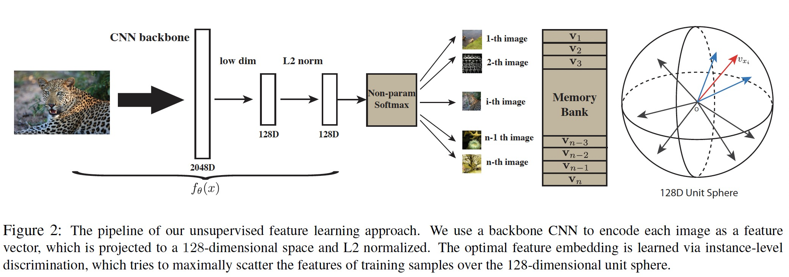

# Visual Self-supervised Learning-Contrastive Learning

## 

## With negative examples (Contrastive method)

### InstDisc:Unsupervised Feature Learning via Non-Parametric Instance Discrimination

- **Motivation:**learn a good feature representation that captures apparent similarity among instances, instead of classes,

- **How:**
  - memory bank store reprsentation
  - NCE loss + Proximal Regularization
  - 
  - 
- Adv vs Disadv
  - Memory bank update every epoch

### CPC: Representation Learning withContrastive Predictive Coding

- Motivation:

  - learn representations by predicting the future in latent space by using powerful autoregressive models. We use a probabilistic contrastive loss which induces the latent space to capture information that is maximally useful to predict future samples
  - learn the representations that encode the underlying shared information between different parts of the (high-dimensional) signal. At the same time it discards low-level information and noise that is more local.

- How:

  - 最大化context和prediction 的互信息

  - When predicting future information we instead encode the target x (future) and context c (present) into a compact distributed vector representations (via non-linear learned mappings) in a way that maximally preserves the mutual information of the original signals x and c defined as

    

  - we do not predict future observations $x_{t+k}$ directly with a generative model $p_k(x_{t+k}|c_t)$. Instead we model a density ratio which preserves the mutual information between $x_{t+k}$ and $c_t$

  - contrastive loss: q: predictions with context $f(x_{t+k}|c_t)$, k+: enbedding of ground truth, k-: sample out of context

  

### CMC:Contrastive Multiview Coding

- Motivation

  - we learn a representation that aims to maximize mutual information between different views of the same scene but is otherwise compact

  - classic hypothesis that a powerful representation is one that models view-invariant

    factors.

- How: positive:same image of different view,e.g. depth image/segmentation image

- Disadvantage: encoder not shared

### MoCo

- we hypothesize that it is desirable to build dictionaries that are: **(i) large and (ii) consistent** as they evolve during training. Intuitively, a larger dictionary may better sample the underlying continuous, highdimensional visual space, while the keys in the dictionary should be represented by the same or similar encoder so that their comparisons to the query are consistent.
- Shuffling BN：The model appears to “cheat” the pretext task and easily finds a low-loss solution. This is possibly because the intra-batch communication among samples (caused by BN) leaks information.
- 

### SimCLR

- In-batch negative
- composition of data augmentations
  - spatial/geometric transformation of data: cropping and resizing (with horizontal flipping), rotation
  - appearance transformation, such as color distortion (including color dropping, brightness, contrast, saturation, hue)
  - it is critical to *compose cropping with color distortion** in order to learn generalizable features.
- global BN:
- Large batch size:
- nonlinear projection head:

​	We conjecture that the importance of **using the representation before the nonlinear projection is due to loss of information induced by the contrastive loss**. **In particular, $z = g(h)$ is trained to be invariant to data transformation. Thus, $g$ can remove information that may be useful for the downstream task, such as the color or orientation of objects**. By leveraging the nonlinear transformation $g(\cdot)$, more information can be formed and maintained in $h$.

- **L2 normalization** (i.e. cosine similarity) along with temperature effectively weights different examples, and an **appropriate temperature** can help the model learn from **hard negatives**; and 2) unlike cross-entropy, other objective functions do not weigh the negatives by their relative hardness.

  

### SwAV:Unsupervised Learning of Visual Features by Contrasting Cluster Assignments

- Motivation:
  - SwAV, that takes advantage of contrastive methods without requiring to compute pairwise comparisons. Specifically, our method simultaneously clusters the data while **enforcing consistency between cluster assignments produced for different augmentations (or “views”) of the same image**, instead of comparing features directly as in contrastive learning.

- How

  

  - Multi-Crop
  - 

## w/o negative examples

### BYOL

### SimSiam:Exploring Simple Siamese Representation Learning

- Motivation:that collapsing solutions do exist for the loss and structure, but a **stop-gradient** operation plays an essential role in preventing collapsing.

- SimSiam as EM algorithm

  考虑以下损失函数:
  $$
  \mathcal L=\mathbb E_{x, \mathcal T}\left[||\mathcal F_\theta(\mathcal T(x))-\eta_x||^2_2\right]
  $$
  $\eta_x$是图片$x$的表示，是一组可学习的参数，$\theta$是网络参数。我们采用EM算法优化这两组参数。目标是:
  $$
  \theta^*,\eta^*=\min \mathcal L(\theta, \eta)
  $$
  我们交替优化:
  $$
  \theta^t \leftarrow \arg \min_\theta \mathcal L(\theta, \eta^{t-1}) \\
  \eta^t \leftarrow \arg \min_\eta \mathcal L(\theta^t, \eta)
  $$

  - E步：优化$\theta$：采用sgd优化$\theta$ 需要采用stop gradient防止梯度回传到$\eta$，因为$\eta$被视为常量
  - M步：优化$\eta_x$ :给定每个$x$并且固定$\theta=\theta_t$优化$\mathcal L$（求导）:

  $$
  \eta_x^t=\arg \min_{\eta_x}\mathbb E_{\mathcal T}[||\mathcal F_{\theta^t}(\mathcal T(x))-\eta_x||^2_2]=\mathbb E_{\mathcal T}[\mathcal F_{\theta^t}(\mathcal T(x))]
  $$

  说明$\eta_x$的最优解是$x$经过augmentation后表征的期望(关于augmentation)

- One-step alternation

  - 通过采样**一次**augmentation $\mathcal T'$对$\eta_x^t$估计：
    $$
    \eta_x^t=\mathcal F_{\theta^t}(\mathcal T'(x))
    $$

  - 对$\theta$优化,带入上式,采用sgd优化
    $$
    \theta^{t+1}=\arg \min \mathbb E_{x, \mathcal T}[||\mathcal F_{\theta}(\mathcal T'(x))-\eta_x^t||]
    $$

- Predictor

​	predictor $h$是对$\mathbb E_{\mathcal T}[\mathcal F_{\theta^t}(\mathcal T(x))]$的估计：
$$
h^*(z_1) = \arg \min_{h(z_1)} \mathbb E_z[||h(z_1)-z_2||_2^2]=\mathbb E_z[z_2]=\mathbb E_{\mathcal T}[f(\mathcal T(x))]
$$
​	在单步优化中,$\mathbb E_{\mathcal T} [\cdot]$被忽略了，$h$视为对其的估计(Expectation over augmentations)，除了用h估计$\mathbb E_{\mathcal T} [\cdot]$，也可以采用动量更新的方式

- Symmetrization

​	Actually, the SGD optimizer computes the empirical expectation of $\mathbb E_{x, \mathcal T}[\cdot]$ by sampling a batch of images and one pair of augmentations $(\mathcal T_1, \mathcal T_2)$. In principle, the empirical expectation should be more precise with **denser sampling**,Symmetrization supplies an extra pair  $(\mathcal T_2, \mathcal T_2)$ This explains that symmetrization is **not necessary** for our method to work, yet it is able to improve accuracy

### DINO

